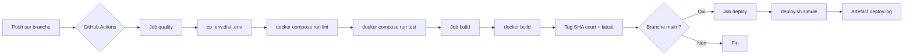

# SkillHub API — EC06 CI/CD & Versioning

[](https://github.com/Yair06/EC06_Yair-Cohen/actions/workflows/ci.yml)

> Mini API Express (Node.js 20) industrialisée avec Git, Docker et GitHub Actions.

## 1. Workflow Git & Docker

### 1.1 Stratégie de branches — GitFlow simplifié

Nous adoptons une stratégie **GitFlow simplifiée** avec les branches suivantes :

| Branche | Rôle | Durée de vie |
|---|---|---|
| `main` | Production stable, protégée | Permanente |
| `develop` | Intégration des features | Permanente |
| `feature/<nom>` | Développement d'une fonctionnalité | Éphémère |

**Justification** : GitFlow simplifié offre un bon équilibre entre rigueur et simplicité pour une équipe réduite. La branche `main` est protégée (merge uniquement via Pull Request avec CI verte). Les branches `feature/*` sont créées depuis `develop` et fusionnées via PR.

**Protection de `main`** :
- Merge uniquement via Pull Request
- Au moins 1 approbation requise (en contexte équipe)
- La CI doit passer au vert avant le merge
- Pas de push direct autorisé

```
main ────●────────────────●──── (production)
          \              /
develop ───●────●────●──● ──── (intégration)
            \       /
feature/x ───●──●──● ──────── (éphémère)
```

### 1.2 Dockerfile multistage

*(Sera ajouté dans la partie 2)*

- **Étape builder** : `node:20-alpine` — installation des dépendances
- **Étape finale** : `node:20-alpine` — image légère, utilisateur non-root
- `EXPOSE 3000`
- `HEALTHCHECK` via `curl` sur `/health`

### 1.3 Docker Compose

*(Sera ajouté dans la partie 2)*

- Service `app` : API Express
- Service `db` : PostgreSQL 16
- Volume persistant pour la BDD
- Variables d'environnement via `env_file: .env`

---

## 2. Architecture du pipeline CI/CD

*(Sera complété dans la partie 3)*



**Déclencheurs** : `push` sur toutes les branches + `pull_request` sur `main`.

---

## 3. Gestion des secrets

| Secret | Où défini | Utilisation |
|---|---|---|
| `DOCKER_USERNAME` | GitHub Secrets | Push image vers registre |
| `DOCKER_PASSWORD` | GitHub Secrets | Push image vers registre |
| `GITHUB_TOKEN` | Automatique GitHub | Permissions CI |

**Règles appliquées** :
- `.env` est dans le `.gitignore` → **jamais versionné**
- `.env.dist` est versionné, contient uniquement des valeurs **placeholder** (ex : `changeme`)
- La CI recrée `.env` à partir de `.env.dist` via `cp .env.dist .env`
- Aucun secret en clair dans `ci.yml` ni dans les logs

---

## 4. Instructions & Limites

### Cloner et lancer en local

```bash
# 1. Cloner le dépôt
git clone https://github.com/<username>/skillhub-api.git
cd skillhub-api

# 2. Configurer l'environnement
cp .env.dist .env
# Modifier .env si besoin

# 3. Lancer l'application
docker compose up

# 4. Tester
curl http://localhost:3000/health
```

### Sans Docker

```bash
npm install
npm start              # serveur sur le port 3000
npm test               # tests Jest
npm run lint           # ESLint
```

### Limites & améliorations futures

- **Non implémenté** : scan d'image Docker (Trivy/Grype), preview environments
- **Améliorations envisagées** :
  - Releases automatisées avec tags sémantiques
  - Scan de vulnérabilités dans le pipeline
  - Déploiement réel sur PaaS (Render, Fly.io)
  - Badges CI/version dans le README
  - Cache des dépendances npm dans la CI
  - Matrice de build multi-versions Node

---

## Endpoints

- `GET /` : message d'accueil
- `GET /health` : statut de l'API (`{ status: "ok", service: "skillhub-api" }`)

## Pré-requis

- Node.js 20+
- Docker et Docker Compose
- Git
