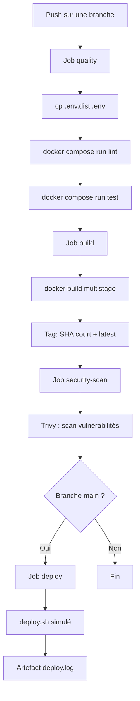

# SkillHub API — EC06 CI/CD & Versioning

[](https://github.com/Yair06/EC06_Yair-Cohen/actions/workflows/ci.yml)

> Mini API Express (Node.js 20) industrialisée avec Git, Docker et GitHub Actions.
> 
> **Dépôt GitHub** : [https://github.com/Yair06/EC06_Yair-Cohen](https://github.com/Yair06/EC06_Yair-Cohen)

---

## 1. Workflow Git & Docker

### 1.1 Stratégie de branches — GitFlow simplifié

Nous adoptons une stratégie **GitFlow simplifiée** avec les branches suivantes :

| Branche | Rôle | Durée de vie |
|---|---|---|
| `main` | Production stable, protégée | Permanente |
| `develop` | Intégration des features | Permanente |
| `feature/<nom>` | Développement d'une fonctionnalité | Éphémère |

**Justification** : GitFlow simplifié offre un bon équilibre entre rigueur et simplicité pour une équipe réduite. La branche `main` est protégée (merge uniquement via Pull Request avec CI verte). Les branches `feature/*` sont créées depuis `develop` et fusionnées via PR.

**Protection de `main`** :
- Merge uniquement via Pull Request
- Au moins 1 approbation requise (en contexte équipe)
- La CI doit passer au vert avant le merge
- Pas de push direct autorisé

```
main ────●────────────────●──── (production)
          \              /
develop ───●────●────●──● ──── (intégration)
            \       /
feature/x ───●──●──● ──────── (éphémère)
```

### 1.2 Dockerfile multistage

Le `Dockerfile` utilise une approche **multistage** pour optimiser la taille de l'image :

| Étape | Image de base | Rôle |
|---|---|---|
| `builder` | `node:20-alpine` | Installe **toutes** les dépendances (dev + prod), copie le code source |
| `production` | `node:20-alpine` | Image finale légère, uniquement les dépendances de production |

**Bonnes pratiques appliquées** :
- **Utilisateur non-root** : l'application tourne sous `appuser` (pas root) pour limiter la surface d'attaque
- **`EXPOSE 3000`** : documentation explicite du port exposé
- **`HEALTHCHECK`** : vérification automatique via `curl -f http://localhost:3000/health` toutes les 30 secondes
- **Cache Docker optimisé** : les fichiers `package.json` et `package-lock.json` sont copiés en premier pour profiter du cache des layers

### 1.3 Docker Compose

Le fichier `docker-compose.yml` orchestre deux services :

| Service | Image | Rôle |
|---|---|---|
| `app` | Build local (Dockerfile) | API Express sur le port 3000 |
| `db` | `postgres:16-alpine` | Base de données PostgreSQL |

**Caractéristiques** :
- **Volume persistant** `pgdata` pour la base de données (les données survivent au `docker compose down`)
- **`env_file: .env`** pour charger les variables d'environnement
- **Healthcheck** sur PostgreSQL (`pg_isready`) — l'app attend que la BDD soit prête avant de démarrer
- **Réseau dédié** `skillhub-network` pour isoler les services

---

## 2. Architecture du pipeline CI/CD

Le pipeline GitHub Actions est défini dans `.github/workflows/ci.yml` et comporte **4 jobs** :



**Déclencheurs** : `push` sur toutes les branches + `pull_request` sur `main`.

### Détail des jobs

| Job | Rôle | Condition |
|---|---|---|
| **quality** | Lint (ESLint) + Tests (Jest) exécutés **dans Docker** via `docker compose run` | Toujours |
| **build** | Construction de l'image Docker, tag avec SHA court, push vers `ghcr.io` sur main | Après quality |
| **security-scan** | Scan de vulnérabilités de l'image avec **Trivy** (CRITICAL + HIGH) | Après build |
| **deploy** | Déploiement simulé via `deploy.sh`, artefact `deploy.log` | Uniquement sur `main` |

---

## 3. Gestion des secrets

| Secret | Où défini | Utilisation |
|---|---|---|
| `DOCKER_USERNAME` | GitHub Secrets | Authentification au registre Docker (ghcr.io) |
| `DOCKER_PASSWORD` | GitHub Secrets | Authentification au registre Docker (ghcr.io) |
| `GITHUB_TOKEN` | Automatique GitHub | Permissions CI (granulaires : `contents: read`, `packages: write`) |

**Règles appliquées** :
- `.env` est dans le `.gitignore` → **jamais versionné**
- `.env.dist` est versionné, contient uniquement des valeurs **placeholder** (ex : `changeme`)
- La CI recrée `.env` à partir de `.env.dist` via `cp .env.dist .env`
- Aucun secret en clair dans `ci.yml` ni dans les logs (GitHub masque automatiquement les `${{ secrets.* }}`)
- **Permissions granulaires** : le `GITHUB_TOKEN` est limité à `contents: read` par défaut, chaque job demande uniquement les permissions nécessaires
- **GitHub Environment** `production` configuré sur le job deploy

---

## 4. Instructions & Limites

### Cloner et lancer en local

```bash
# 1. Cloner le dépôt
git clone https://github.com/Yair06/EC06_Yair-Cohen.git
cd EC06_Yair-Cohen

# 2. Configurer l'environnement
cp .env.dist .env
# Modifier .env si besoin (port, credentials BDD, etc.)

# 3. Lancer l'application
docker compose up

# 4. Tester
curl http://localhost:3000/health
# Réponse : { "status": "ok", "service": "skillhub-api" }
```

### Sans Docker

```bash
npm install
npm start              # serveur sur le port 3000
npm test               # tests Jest
npm run lint           # ESLint
```

### Limites & améliorations futures

- **Améliorations envisagées** :
  - Déploiement réel sur PaaS (Render, Fly.io, Railway)
  - Releases automatisées avec tags sémantiques (`v1.0.0`, `v1.1.0`)
  - Preview environments sur les PR
  - Matrice de build multi-versions Node (20, 22)
  - Notifications Slack/Discord sur échec de la CI

---

## Endpoints

| Route | Méthode | Description |
|---|---|---|
| `/` | GET | Message d'accueil |
| `/health` | GET | Statut de l'API (`{ status: "ok", service: "skillhub-api" }`) |

## Pré-requis

- Node.js 20+
- Docker et Docker Compose
- Git
